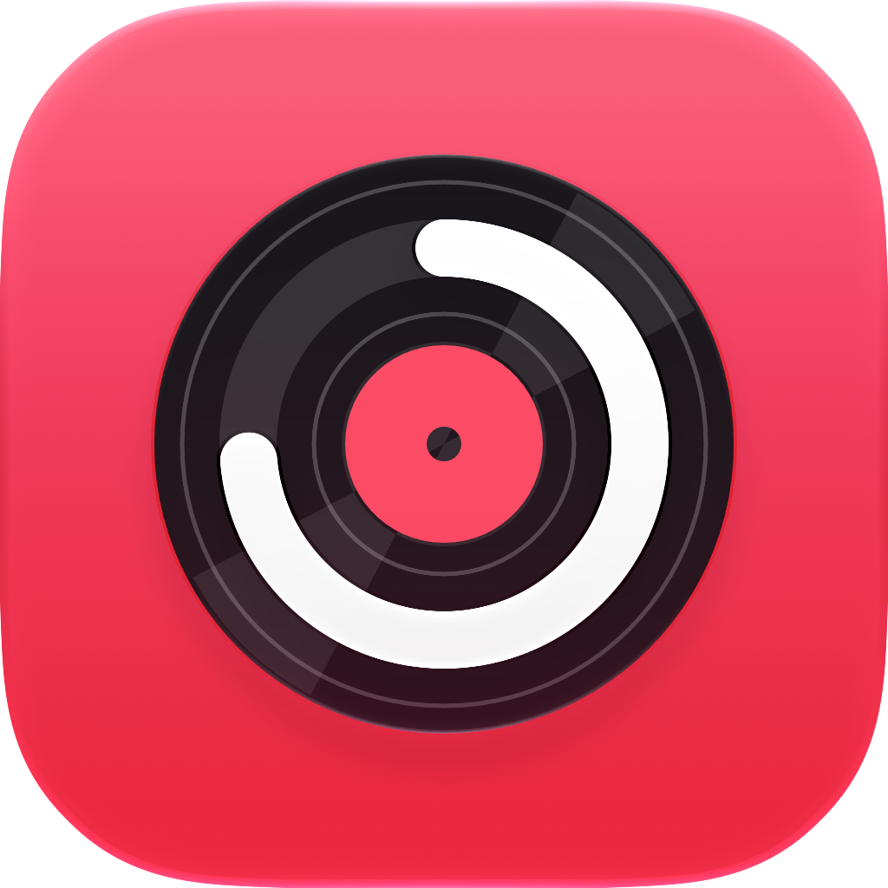
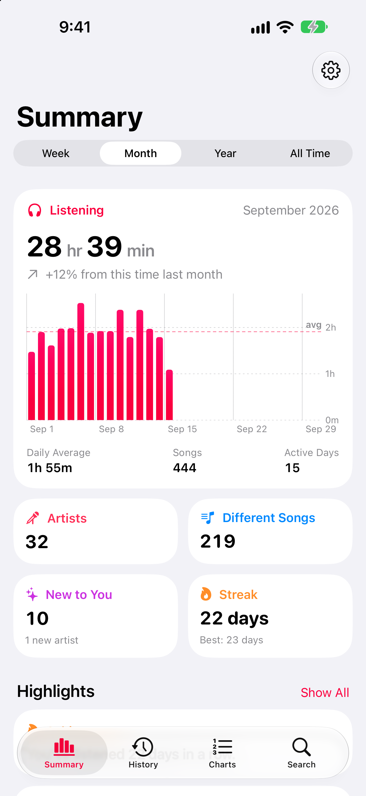
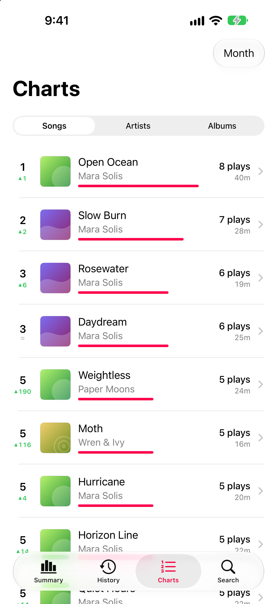
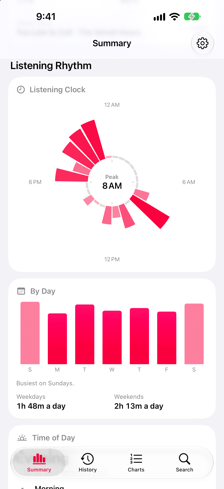
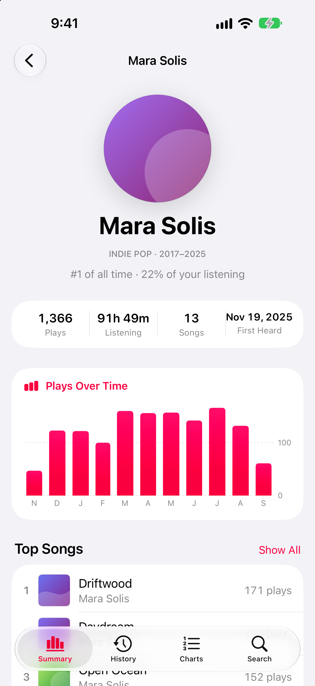
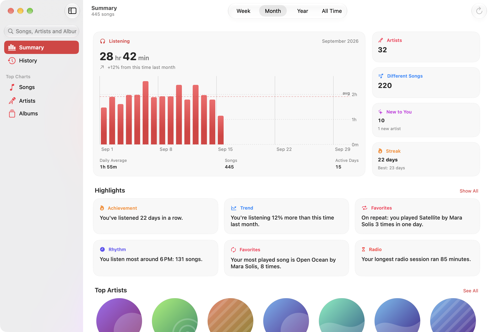
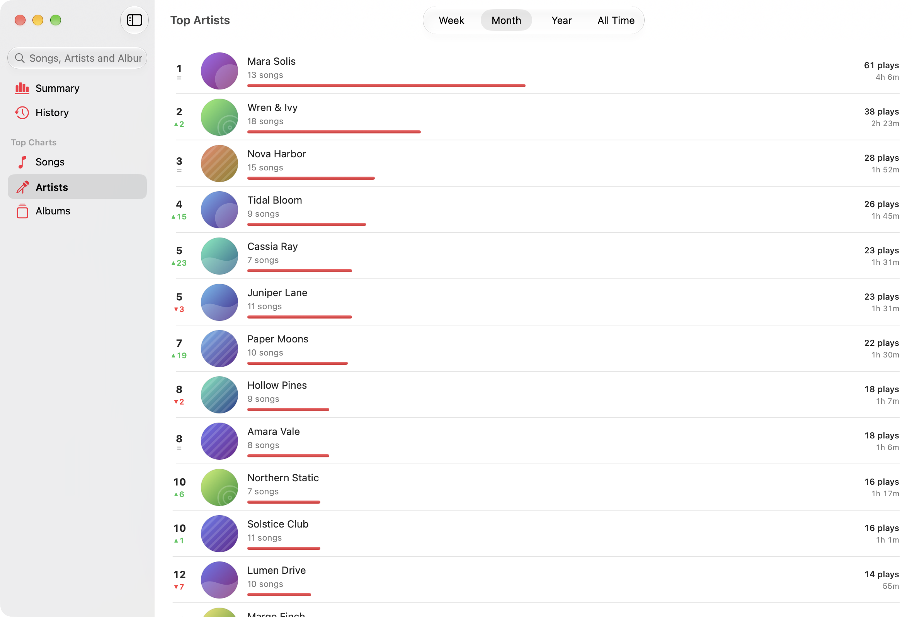

<p align="center">
  
</p>

<h1 align="center">Motif</h1>

<p align="center">
  <strong>You listen. Motif remembers.</strong>
</p>

Motif is a beautiful native MacOS and IOS app that keeps a history of what you play in Apple Music, scrobbles it to Last.fm, and shows you statistics about it. That includes songs played on demand, songs heard on Apple Music radio (Apple doesn't count those as plays), and songs picked up from Apple's Recently Played list for times when Motif wasn't running.

Motif's a native iPhone and Mac app written in SwiftUI, with SwiftData and CloudKit for storage.
There's no server and no analytics. Your history stays on your devices and in your private
iCloud database.

## Screenshots

<p align="center">
  
  
  
  
</p>

<p align="center">
  
</p>

<p align="center">
  
</p>

All screenshots use the built-in sample data

## Features

### Your history

- Songs you play in Apple Music, on demand or on a radio station. Apple doesn't count songs
  heard on a station as plays, but Motif keeps each one.
- Songs that played while Motif wasn't running, recovered from Apple Music's Recently Played.
- Covers that stop loading can be found and fetched again from Settings.
- iCloud sync between your iPhone and your Mac, covering settings as well as history.

### Insights

- Listening time for the week, month, year or all time, compared with the same point last time, with a bar for every day and a daily average.
- Top songs, artists and albums, with how far each moved since the last period.
- A 24-hour listening clock, a weekday chart and, on the Mac, a week-by-hour heat map.
- Streaks, songs and artists you heard for the first time, and short written highlights
- A page for every artist, album and song: plays over time, rank, first and last heard.
- Search across everything you've played.

### Scrobbling

- Connect a Last.fm account and Motif scrobbles every song it keeps, radio and recovered songs included.

### Radio

- Songs you hear on stations are added to a "Heard on Radio" playlist in your library,
  which stops at 250 songs so a station left running can't fill it. The limit is yours to
  change or turn off.
- Play Back plays those songs again through Apple Music so that Apple counts them. It only runs when you're at the device to hear it.
- You can exclude stations you don't want recorded.

### On the Mac

- A sidebar window with a dashboard Summary, a sortable history table with an inspector, and top charts.
- A menu bar extra with the current song and its cover, playback controls, today's listening and streak, and your last few songs. The status item can show a symbol, the cover, the title, the artist, or a format you write.
- A Settings window with General, Scrobbling, Radio and Menu Bar panes.

### Widgets & Shortcuts

- Widgets for the Home Screen and the Mac desktop. _Listening_ shows the last seven days and your streak (and comes in Lock Screen sizes on iPhone); _Last Played_ shows the last song Motif kept; _Today_ shows today's songs and the radio songs queued for play-back.
- A Control Center control that plays back today's radio songs.
- _Save Current Radio Song_ and _Play Back Today_ actions for Siri, Spotlight and Shortcuts.

### Privacy

- There's no Motif server or account, and the app collects no analytics.
- Your history is stored on your device and in your private iCloud database.
- Last.fm is only contacted if you connect an account, and its session key is kept in the Keychain.

## Requirements

|               |                                                                 |
| ------------- | --------------------------------------------------------------- |
| Xcode         | 27 or later                                                     |
| Run on        | iOS 27 or later, macOS 27 or later                              |
| XcodeGen      | `brew install xcodegen`                                         |
| For devices   | An Apple Developer account                                      |
| For listening | An Apple Music subscription, for capture and the radio features |

The simulator and an unsigned Mac build need no developer account.

## Getting started

```sh
git clone https://github.com/reallukedev/motif.git
cd motif
brew install xcodegen
xcodegen generate
open Motif.xcodeproj
```

Choose the **Motif (iOS)** scheme and an iPhone simulator, then run. If Xcode reports a
signing problem, set your own team in `Config/Local.xcconfig` as described in
[Building for a device](#building-for-a-device).

The Xcode project is generated from [`project.yml`](project.yml) and is not committed. Run
`xcodegen generate` again whenever you pull, or add, move or rename a file.

### Demo data

The simulator has no Apple Music account, so there is nothing to record. To see every screen with realistic data, add a launch argument:

1. **Product › Scheme › Edit Scheme… › Run › Arguments**.
2. Under _Arguments Passed On Launch_, add `-MotifDemoData YES`.

Motif then fills an in-memory store with invented listening history, so you can explore every screen without an Apple Music account. Nothing it shows is saved, synced or scrobbled. The argument works in either scheme.

Debug builds understand a few more launch arguments for jumping straight to a screen, listed in [`LaunchScene.swift`](Apps/Shared/App/LaunchScene.swift). `./Tools/screenshots.sh` uses them to capture the App Store screenshots.

## Building for a device

A device build, and any Mac build you intend to run, has to be signed with your own team.

1. Set your team and bundle identifier. Copy the template and fill it in:

    ```sh
    cp Config/Local.example.xcconfig Config/Local.xcconfig
    ```

    ```
    DEVELOPMENT_TEAM = ABCDE12345
    MOTIF_BUNDLE_ID = com.example.Motif
    ```

    `Local.xcconfig` is gitignored and overrides the maintainer's defaults in
    [`Config/Motif.xcconfig`](Config/Motif.xcconfig). Leave the tracked file alone.

2. In the Apple Developer portal, create an Explicit App ID for your bundle identifier and
   tick MusicKit under App Services. There's no MusicKit entitlement to add. Once the App ID
   has the service, developer tokens are issued automatically.

3. The App Group and iCloud container are derived from your bundle identifier:

    |                  | iOS                     | macOS                         |
    | ---------------- | ----------------------- | ----------------------------- |
    | App Group        | `group.<bundle id>`     | `<team id>.group.<bundle id>` |
    | iCloud container | `iCloud.<bundle id>`    | `iCloud.<bundle id>`          |
    | Key-value store  | `<team id>.<bundle id>` | `<team id>.<bundle id>`       |

    Automatic signing registers them on the first signed build. The widget extensions use
    `<bundle id>.Widgets`.

    The history syncs through the iCloud container; settings and the songs you've removed go
    through the key-value store, because the widgets read them without opening the model
    container. Both identifiers have to match across the two apps for a device to see the
    other's changes, which is why they share a bundle identifier.

4. Generate the project and build:

    ```sh
    xcodegen generate
    ./build.sh mac     # signed Mac build, then checks the entitlements actually landed
    ```

    For an iPhone, choose the **Motif (iOS)** scheme and your device in Xcode.

> [!IMPORTANT]
> Sign the Mac app if you want to use it. An unsigned build has no App Group entitlement, so
> Motif falls back to an in-memory store and keeps nothing, while looking normal.
> `./build.sh mac` fails if the App Group or iCloud entitlement is missing from the built app.

If you see `developerTokenRequestFailed`, MusicKit couldn't get a developer token. Check that
the App ID is Explicit, that MusicKit is ticked for it, and that the build is signed with
that team.

## Last.fm

Scrobbling is optional. Without it, Motif builds and runs normally and says that no Last.fm
application is configured.

1. Register an application at [last.fm/api/account/create](https://www.last.fm/api/account/create).
2. Copy the template and fill in the API key and shared secret:

    ```sh
    cp Config/Secrets.example.xcconfig Config/Secrets.xcconfig
    ```

    ```
    MOTIF_LASTFM_API_KEY = your-api-key
    MOTIF_LASTFM_SECRET = your-shared-secret
    ```

3. Rebuild, open **Settings**, and connect your account.

`Secrets.xcconfig` is gitignored. Never put these values in a tracked file.

## Testing

```sh
cd MotifCore && swift test
```

About 300 [Swift Testing](https://developer.apple.com/documentation/testing) tests cover the package. Many use values captured from real devices, such as queue entry ids and notification payloads, so if Apple changes its behavior, a test fails.

`swift test` runs them on the Mac only. The iOS capture code is tested in the Simulator, either with ⌘U on the Motif (iOS) scheme or with `./build.sh test`, which runs both.

To run exactly what CI runs (the tests on both platforms, then unsigned builds of both apps):

```sh
./build.sh ci
```

## Contributing

Contributions are welcome. Read [CONTRIBUTING.md](CONTRIBUTING.md) for setup, conventions and the pull request checklist, and [docs/PlatformNotes.md](docs/PlatformNotes.md) before changing anything that talks to Apple Music. This project follows the [Contributor Covenant](CODE_OF_CONDUCT.md).

Please report security problems privately, as described in [SECURITY.md](SECURITY.md).

## Privacy Policy

Motif has no server and collects no analytics. Your listening history is stored on your device, in an App Group container shared with Motif's widgets, and mirrored to your private iCloud database so your devices stay in sync. The developer can't read it.

Motif talks to Apple Music for catalog lookups, artwork and the "Heard on Radio" playlist. If you connect Last.fm, it sends the songs it keeps there as scrobbles. Your history isn't sent anywhere else. The full policy is in [PRIVACY.md](PRIVACY.md).

## License

Motif is available under the [MIT License](LICENSE).

Apple Music, iPhone and Mac are trademarks of Apple Inc. Motif is not affiliated with or
endorsed by Apple or Last.fm.
