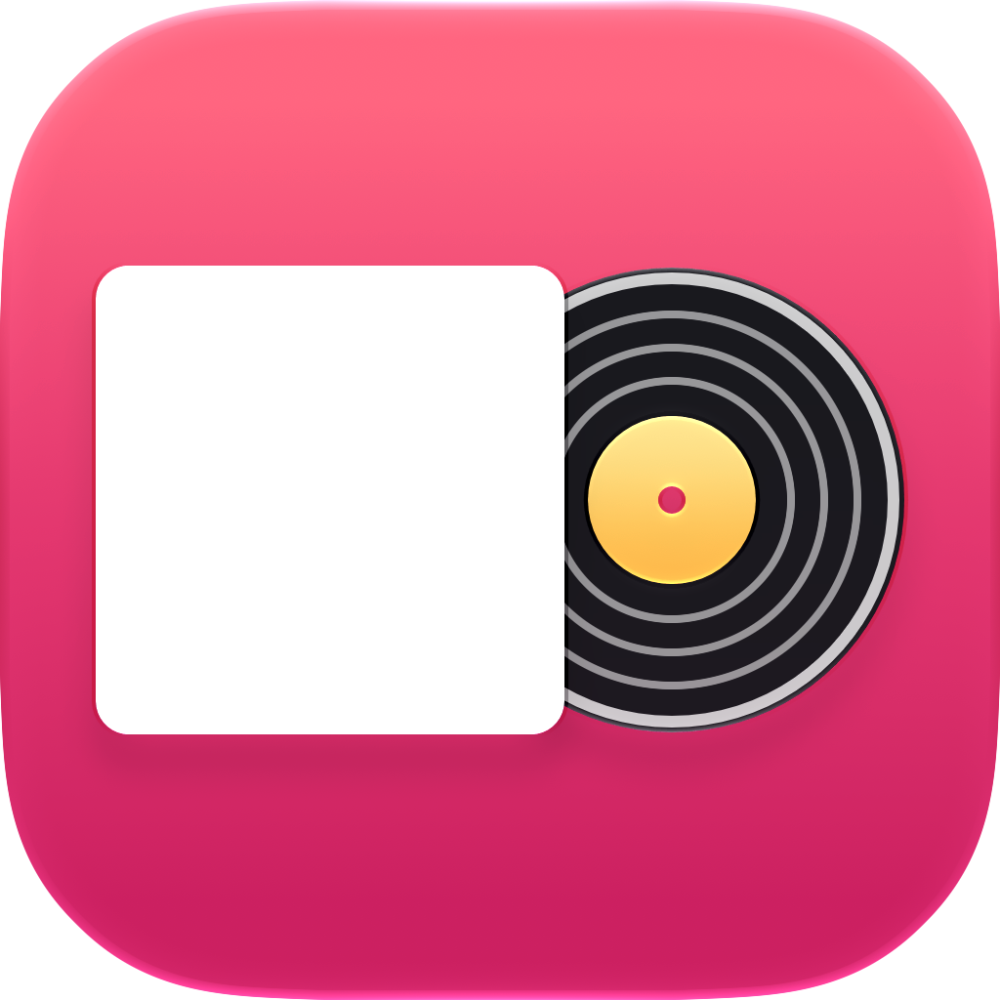
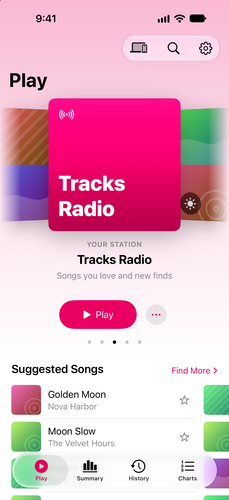
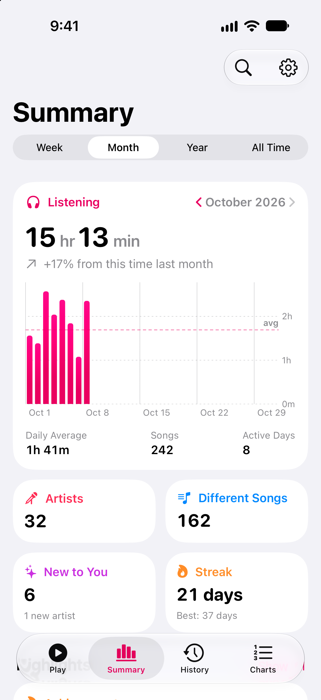
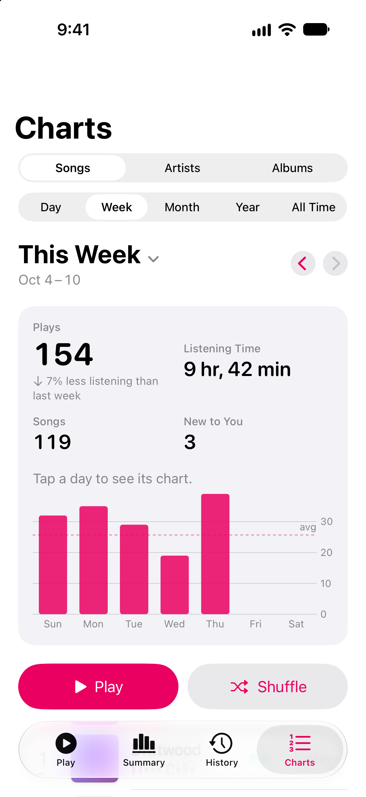
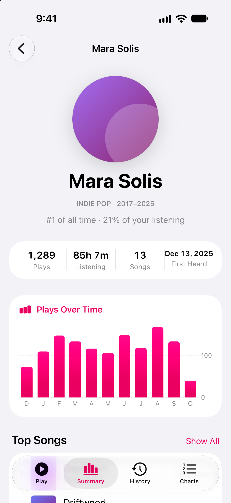
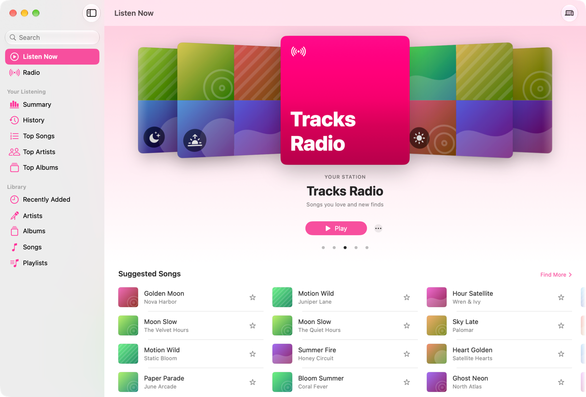
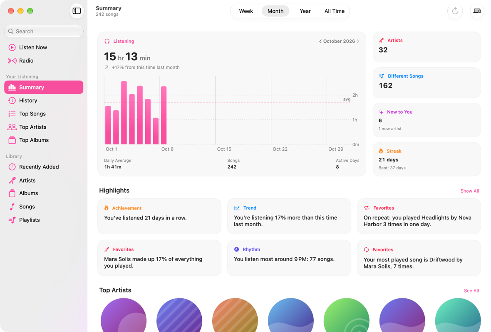

<p align="center">
  
</p>

<h1 align="center">Tracks</h1>

<p align="center">
  <strong>Keep track. Find more.</strong>
</p>

Tracks is a music app for iPhone and Mac. Play Apple Music or your own library, and Tracks
keeps every song you hear, radio included, then turns it into mixes, stations and charts,
and finds the songs and artists you'll want next. It scrobbles to Last.fm if you like.

It's written in SwiftUI, with SwiftData and CloudKit for storage. There's no server and no
analytics. Your history stays on your devices and in your private iCloud database.

Tracks replaces Motif. On a device that has Motif, it brings your Motif history over by
itself the first time it opens.

## Screenshots

<p align="center">
  
  
  
  
</p>

<p align="center">
  
</p>

<p align="center">
  
</p>

All screenshots use the built-in sample data

## Features

### Your history

- Songs you play in Apple Music, on demand or on a radio station. Apple doesn't count songs
  heard on a station as plays, but Tracks keeps each one.
- Songs that played while Tracks wasn't running, recovered from Apple Music's Recently Played.
- Covers that stop loading can be found and fetched again from Settings.
- iCloud sync between your iPhone and your Mac, covering settings as well as history.

### Insights

- Listening time for the week, month, year or all time, compared with the same point last time, with a bar for every day and a daily average.
- Top songs, artists and albums, with how far each moved since the last period.
- A 24-hour listening clock, a weekday chart and, on the Mac, a week-by-hour heat map.
- Streaks, songs and artists you heard for the first time, and short written highlights
- A page for every artist, album and song: plays over time, rank, first and last heard.
- Search across everything you've played.

### Scrobbling

- Connect a Last.fm account and Tracks scrobbles every song it keeps, radio and recovered songs included.

### Play (iPhone and Mac)

- A Play tab on iPhone, and Listen Now and Radio in the Mac's sidebar, that play Apple Music
  inside Tracks, so every song is kept even with the app in the background: the library, live
  radio, your stations, albums, playlists and the catalog, with search.
- The crate: this hour's mix, Tracks Radio and the rest of the day's mixes to flip through,
  Cover Flow style. Tap the cover in Now Playing and it turns over to your history with the
  song.
- On the Mac: a player bar at the foot of the window, Up Next and Your History beside the
  page, a full player, a Mini Player, a Controls menu with Music's shortcuts, and the song
  in the menu bar and the Dock.
- Mixes built from your own history: what you play at each time of day, On Repeat, New
  Finds, All-Time Favorites, Deep Cuts, Radio Finds, Rediscover and a year ago this week.
  Songs you skip or ask to hear less of drop out, and shuffle keeps each artist apart.
- Tracks Radio, your own endless station, tunable, picked a song at a time from everything
  you love and new finds like it. Suggested Songs and Suggested Artists, with finders for
  songs and artists you've never played and an endless Keep Exploring list.
- Moods (Feel Good, Energy, Chill, Love, Heartbreak and more) to go with the flow or to find
  new music in, and New from Your Artists with upcoming releases.
- Now Playing with your play count for the song, a ring that fills until the song is kept,
  Up Next, Create Station, AirPlay and a sleep timer. Settings for explicit songs,
  crossfade (iPhone), the layout, and whether songs elsewhere play in Tracks or Apple Music.
- Your Music: play the FLAC and other files you own, and your own Subsonic-compatible
  server (Navidrome and others), with downloads for offline, discovery on your servers, and
  Tracks Radio, mixes and moods made from all of it. Suggestions are checked against what you
  have, and Lidarr can fetch what you don't.
- Siri ("Play music in Tracks") and CarPlay. CarPlay needs Apple's CarPlay Audio
  entitlement on a device; see `Config/Tracks.xcconfig`.
- SharePlay: passengers add songs to Up Next from their iPhones, invited in Messages or by
  scanning a code on your iPhone or the car's screen. Without Tracks, they join from its App
  Clip. See [SharePlay by code](#shareplay-by-code).

### Radio

- Songs you hear on stations are added to a "Heard on Radio" playlist in your library.
  Apple Music doesn't let apps take songs back out, so trim it in Music when you like.
- Play Back plays those songs again through Apple Music so that Apple counts them. It only runs when you're at the device to hear it.
- You can exclude stations you don't want recorded.

### On the Mac

- A sidebar window with a dashboard Summary, a sortable history table with an inspector, and top charts.
- A menu bar extra with the current song and its cover, playback controls, today's listening and streak, and your last few songs. The status item can show a symbol, the cover, the title, the artist, or a format you write.
- A Settings window with General, Scrobbling, Radio and Menu Bar panes.

### Widgets & Shortcuts

- Widgets for the Home Screen and the Mac desktop. _Listening_ shows the last seven days and your streak (and comes in Lock Screen sizes on iPhone); _Last Played_ shows the last song Tracks kept; _Today_ shows today's songs and the radio songs queued for play-back.
- A Control Center control that plays back today's radio songs.
- _Save Current Radio Song_ and _Play Back Today_ actions for Siri, Spotlight and Shortcuts.

### Privacy

- There's no Tracks server or account, and the app collects no analytics.
- Your history is stored on your device and in your private iCloud database.
- Last.fm is only contacted if you connect an account, and its session key is kept in the Keychain.

## Requirements

|               |                                                                 |
| ------------- | --------------------------------------------------------------- |
| Xcode         | 27 or later                                                     |
| Run on        | iOS 27 or later, macOS 27 or later                              |
| XcodeGen      | `brew install xcodegen`                                         |
| For devices   | An Apple Developer account                                      |
| For listening | An Apple Music subscription, for capture and the radio features |

The simulator and an unsigned Mac build need no developer account.

## Getting started

```sh
git clone https://github.com/reallukedev/tracks.git
cd tracks
brew install xcodegen
xcodegen generate
open Tracks.xcodeproj
```

Choose the **Tracks (iOS)** scheme and an iPhone simulator, then run. If Xcode reports a
signing problem, set your own team in `Config/Local.xcconfig` as described in
[Building for a device](#building-for-a-device).

The Xcode project is generated from [`project.yml`](project.yml) and is not committed. Run
`xcodegen generate` again whenever you pull, or add, move or rename a file.

### Demo data

The simulator has no Apple Music account, so there is nothing to record. To see every screen with realistic data, add a launch argument:

1. **Product › Scheme › Edit Scheme… › Run › Arguments**.
2. Under _Arguments Passed On Launch_, add `-TracksDemoData YES`.

Tracks then fills an in-memory store with invented listening history, so you can explore every screen without an Apple Music account. Nothing it shows is saved, synced or scrobbled. The argument works in either scheme.

Debug builds understand a few more launch arguments for jumping straight to a screen, listed in [`LaunchScene.swift`](Apps/Shared/App/LaunchScene.swift). `./Tools/screenshots.sh` uses them to capture the App Store screenshots.

## Building for a device

A device build, and any Mac build you intend to run, has to be signed with your own team.

1. Set your team and bundle identifier. Copy the template and fill it in:

    ```sh
    cp Config/Local.example.xcconfig Config/Local.xcconfig
    ```

    ```
    DEVELOPMENT_TEAM = ABCDE12345
    TRACKS_BUNDLE_ID = com.example.Tracks
    ```

    `Local.xcconfig` is gitignored and overrides the maintainer's defaults in
    [`Config/Tracks.xcconfig`](Config/Tracks.xcconfig). Leave the tracked file alone.

2. In the Apple Developer portal, create an Explicit App ID for your bundle identifier and
   tick MusicKit under App Services. There's no MusicKit entitlement to add. Once the App ID
   has the service, developer tokens are issued automatically.

3. The App Group and iCloud container are derived from your bundle identifier:

    |                  | iOS                     | macOS                         |
    | ---------------- | ----------------------- | ----------------------------- |
    | App Group        | `group.<bundle id>`     | `<team id>.group.<bundle id>` |
    | iCloud container | `iCloud.<bundle id>`    | `iCloud.<bundle id>`          |
    | Key-value store  | `<team id>.<bundle id>` | `<team id>.<bundle id>`       |

    Automatic signing registers them on the first signed build. The widget extensions use
    `<bundle id>.Widgets`.

    The history syncs through the iCloud container; settings and the songs you've removed go
    through the key-value store, because the widgets read them without opening the model
    container. Both identifiers have to match across the two apps for a device to see the
    other's changes, which is why they share a bundle identifier.

4. Generate the project and build:

    ```sh
    xcodegen generate
    ./build.sh mac     # signed Mac build, then checks the entitlements actually landed
    ```

    For an iPhone, choose the **Tracks (iOS)** scheme and your device in Xcode.

> [!IMPORTANT]
> Sign the Mac app if you want to use it. An unsigned build has no App Group entitlement, so
> Tracks falls back to an in-memory store and keeps nothing, while looking normal.
> `./build.sh mac` fails if the App Group or iCloud entitlement is missing from the built app.

If you see `developerTokenRequestFailed`, MusicKit couldn't get a developer token. Check that
the App ID is Explicit, that MusicKit is ticked for it, and that the build is signed with
that team.

## Last.fm

Scrobbling is optional. Without it, Tracks builds and runs normally and says that no Last.fm
application is configured.

1. Register an application at [last.fm/api/account/create](https://www.last.fm/api/account/create).
2. Copy the template and fill in the API key and shared secret:

    ```sh
    cp Config/Secrets.example.xcconfig Config/Secrets.xcconfig
    ```

    ```
    TRACKS_LASTFM_API_KEY = your-api-key
    TRACKS_LASTFM_SECRET = your-shared-secret
    ```

3. Rebuild, open **Settings**, and connect your account.

`Secrets.xcconfig` is gitignored. Never put these values in a tracked file.

## SharePlay by code

Passengers join SharePlay by scanning a code. Two ways connect them to the host's iPhone,
and a guest uses whichever answers first:

- **Nearby**: Bonjour over Wi-Fi, peer-to-peer included, so it works in a car with no
  network. It needs Local Network permission on both iPhones.
- **The relay**: a Supabase project's Realtime channel, for the Tracks App Clip (Apple keeps
  Bonjour from App Clips) and anyone who can't connect nearby. Messages are sealed with
  AES-GCM under a key derived from the code, so the relay only passes along boxes it can't
  open.

To use the relay, add the project's host and publishable key to `Config/Secrets.xcconfig`
(see `Secrets.example.xcconfig`). Without them, joining by code works nearby only. The live
relay test in TracksCore runs when `TRACKS_RELAY_HOST` and `TRACKS_RELAY_KEY` are set in the
environment.

The code holds a `tracks://` link until the App Clip is live, so only iPhones with Tracks can
join. To let anyone join:

1. Create the App Clip's App ID, `<bundle id>.Clip`. Automatic signing does this on the
   first device build of the **Tracks (iOS)** scheme in Xcode, which embeds
   **TracksClip (iOS)**. Do it there once before an Xcode Cloud build: Xcode Cloud can't
   register a new identifier. The app's own entitlements files name no App Clip; Xcode adds
   that entitlement when it archives.
2. Upload a build to App Store Connect. On the app's version page, set up the **default App
   Clip experience**: a header image, the subtitle "Add songs to what's playing" and the
   action **Open**. App Store Connect makes its default link,
   `https://appclip.apple.com/id?p=<bundle id>.Clip`.
3. To try it before release, add a Local Experience on your iPhone (Settings → Developer →
   Local Experiences) for that link and the App Clip's bundle id, and install through
   TestFlight.
4. Once it's live, set `TRACKS_APP_CLIP_LIVE = YES` in `Config/Tracks.xcconfig`. The code then
   holds the App Clip link, with the code in a `c` parameter: Tracks opens where it's
   installed, the App Clip where it isn't.

In the simulator, open the App Clip with a code by passing `-TracksClipURL <link>`, or show
sample sessions with `-TracksClipDemo joined` (also `joining`, `reconnecting`, `ended`,
`nocode`).

## Testing

```sh
cd TracksCore && swift test
```

About 300 [Swift Testing](https://developer.apple.com/documentation/testing) tests cover the package. Many use values captured from real devices, such as queue entry ids and notification payloads, so if Apple changes its behavior, a test fails.

`swift test` runs them on the Mac only. The iOS capture code is tested in the Simulator, either with ⌘U on the Tracks (iOS) scheme or with `./build.sh test`, which runs both.

To run exactly what CI runs (the tests on both platforms, then unsigned builds of both apps):

```sh
./build.sh ci
```

## Contributing

Contributions are welcome. Read [CONTRIBUTING.md](CONTRIBUTING.md) for setup, conventions and the pull request checklist, and [docs/PlatformNotes.md](docs/PlatformNotes.md) before changing anything that talks to Apple Music. This project follows the [Contributor Covenant](CODE_OF_CONDUCT.md).

Please report security problems privately, as described in [SECURITY.md](SECURITY.md).

## Privacy Policy

Tracks has no server and collects no analytics. Your listening history is stored on your device, in an App Group container shared with the Tracks widgets, and mirrored to your private iCloud database so your devices stay in sync. The developer can't read it.

Tracks talks to Apple Music for catalog lookups, artwork and the "Heard on Radio" playlist. If you connect Last.fm, it sends the songs it keeps there as scrobbles. Your history isn't sent anywhere else. The full policy is in [PRIVACY.md](PRIVACY.md).

## License

Tracks is available under the [MIT License](LICENSE).

Apple Music, iPhone and Mac are trademarks of Apple Inc. Tracks is not affiliated with or
endorsed by Apple or Last.fm.
